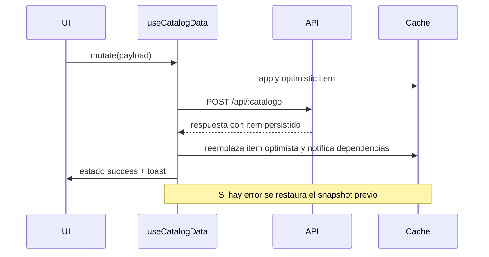

# Módulo de Configuración

El módulo reúne los catálogos base que habilitan el resto de la aplicación. Incluye formularios con validaciones reutilizables, tablas auditables y componentes de soporte (banners de sincronización, breadcrumbs y navegación secundaria).

## Triggers y sincronizaciones

| Catálogo | Evento | Dispara | Descripción |
| --- | --- | --- | --- |
| Actividades | Alta/edición | Módulos de consumos y producción | Se invalida el cache `consumos` y se emite evento global `catalog:actividades-updated`. |
| Empleados | Cambio de centro | Planeación y aprobaciones | Se recalculan permisos dinámicos y se notifica a `QA` a través de `onHttpError` si falla la sincronización. |
| Centros | Alta | Costeo | Se notifica al backend para recalcular las jerarquías de centros. |
| Parámetros generales | Actualización de política | Reportes y contabilidad | Se guarda snapshot de auditoría para QA y se propaga al tablero de métricas. |

Los triggers están centralizados en los hooks (`useCatalogData`) que invalidan los caches dependientes tras cada mutación.

## Diagrama de secuencia simplificado

## Auditoría

Todos los registros mantienen `createdBy`, `createdAt`, `updatedBy`, `updatedAt` y `changeReason`. Esta metadata se renderiza en las tablas y puede utilizarse para filtros específicos mediante la barra de búsqueda.

## Documentación adicional

- [Guía de catálogos](../../../frontend-description/catalogos.md)
- [Estados de sincronización](../../../frontend-description/asientos-control.md)
- [Lineamientos UI](../../../frontend-description/ui-ux-guidelines.md)
